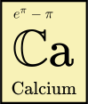

Calcium
===================================

.. .. math :: \mathbb{Ca}

**Calcium** (pronounced "kalkium") is a C library for exact computation
with real and complex numbers, presently in early development.

Calcium is free software (LGPL). It depends on
`GMP <https://gmplib.org/>`_, `MPFR <https://mpfr.org/>`_,
`FLINT <http://flintlib.org/>`_ and `Arb <http://arblib.org/>`_.

Planned features:

* An easy-to-use main number type (:type:`ca_t`) with support for different internal representations
* Complete support for algebraic numbers and (necessarily partial) support for common types of transcendental numbers
* Support for extended values to represent limiting values and error conditions (signed and unsigned infinities, Undefined, Unknown)
* Advanced algorithms for simplifying representations of numbers, testing numbers for equality, and finding closed-form values of special functions
* Sets of numbers (finite sets, intervals, simple discrete sets, finite unions and intersections)
* Polynomials and matrices with exact real and complex entries

Module documentation
---------------------------

.. toctree::
   :maxdepth: 2

   ca_qqbar.rst

FAQ
---------------------------

**I thought exact calculation with real numbers isn't possible. Isn't x = 0 undecidable?**

In general, yes. In practice, much of calculus
and number theory only depends on numbers that are
simple combinations of well-known elementary
and special functions, and there are heuristics that work quite well
for deciding predicates about such numbers.
Calcium will be able to give a definitive answer at least in 
simple cases (for example, proving 
`16 \operatorname{atan}(\tfrac{1}{5}) - 4 \operatorname{atan}(\tfrac{1}{239}) = \pi`
or `\sqrt{5+2\sqrt{6}} = \sqrt{2}+\sqrt{3}`),
and will simply answer "Unknown" when its heuristics are not powerful enough.

**Isn't it going to be horribly slow?**

It will definitely be too slow to replace floating-point numbers
for 99.9% of scientific computing. The target is symbolic and algebraic computation.
A big factor in making this kind of library practical is that
FLINT now has extremely fast multivariate polynomial arithmetic
which can be used to implement multivariate transcendental number fields
with adequate performance.

Calcium will generally be much slower than arbitrary-precision ball arithmetic.
It will often make sense for users to first try a numerical evaluation with Arb,
and fall back on an exact calculation with Calcium only if that
fails (typically because an exact comparison is needed).

It should be expected that early versions of the library will have quite
poor performance but that the situation will improve as more optimizations
are added; for example, the initial implementation of algebraic numbers
in Calcium will use minimal polynomials to represent individual algebraic
numbers, but later versions could be optimized by working in number fields
whenever that makes sense.

**Why this C library? Why not use a computer algebra system?**

Calculating with constant values is only a small part of what
a computer algebra system has to do, but it is actually one
of the most complex parts.
Calcium is intended to take some of the complexity out of the task
of building a computer algebra system by offering a black-box
solution to the "constant problem".
This solution will not be perfect, but it will be "good enough"
for many applications.
C is a pain, but it is the best choice for building a library that will
not be tied to a particular computer algebra system
or programming language ecosystem.
Initially, the goal of Calcium will be to implement high-performance
basic data structures in C; this will enable future experimentation with algorithms
in both C and in high-level languages using wrappers.

Architecture
==============

A calcium element (:type:`ca_t`) will be a tagged union which can hold one of the following:

**A field element**

* An element of the rational field `\mathbb{Q}` or the Gaussian rational field `\mathbb{Q}(i)`,
  represented inline as an *fmpz* tuple.

* An element of an extension field `\mathbb{Q}(a_1, \ldots, a_n)` or
  `\mathbb{Q}(i)(a_1, \ldots, a_n)` where `a_i` are Calcium numbers (which may
  be algebraic or transcendental). An extension field element is stored as a tuple
  of *fmpz_mpoly* instances together with a reference to an object defining the field `a_1, \ldots, a_n`.

**A single algebraic number**

* Represented in canonical form by an *fmpz_poly* holding an irreducible polynomial in `\mathbb{Z}[x]` together with an isolating complex interval.

**A symbolic expression**

* A number of the form `f(a_1, \ldots, a_n)` where `a_i` are Calcium numbers
  and `f` is a builtin symbol representing a function or constant (e.g. Exp, Gamma, Pi).
  The main purpose of symbolic expressions is to construct transcendental field extension
  elements, but they may also used for lazy evaluation of field operations and algebraic
  numbers where constructing the explicit fields or field elements would be expensive.

**A special nonnumerical value**

* *Unsigned infinity*, a formal object `{\tilde \infty}` representing the value of `1 / 0`.

* *Signed infinity*, a formal object `a \cdot \infty` where the sign `a` is a Calcium number with `|a| = 1`.
  The most common values are `+\infty, -\infty, +i \infty, -i \infty`.

* *Undefined*, a formal object representing the value of indeterminate
  forms such as `0 / 0`, where a number or infinity would not make sense
  as an answer, much like a *NaN* in floating-point arithmetic. Including this
  special value allows Calcium elements to form a closed arithmetic
  system.

* *Unknown*, a meta-value used to signal that the actual desired value
  could not be computed, either because Calcium does not (yet) have a data
  structure or algorithm for that case, or because doing so would be
  unreasonably expensive. Wrappers may want to check any output variable for
  *Unknown* and throw an exception (e.g. *NotImplementedError* in Python).

  Note that we distinguish between *Calcium numbers* (which must represent
  elements of `\mathbb{C}`) and special nonnumerical values. The latter may
  not be used as field extension elements
  (and tentatively also not within symbolic expressions).

Calcium elements are mutable. Memory management works as follows: the coefficients
of a field element are stored as mutable data along with each individual :type:`ca_t`.
Elements `a_1, \ldots, a_n` defining extension fields or arguments of symbolic expressions
are immutable instances cached within the context object (:type:`ca_ctx_t`). Using a
Calcium element as an argument to an operation that constructs a symbolic expression or
a new field extension causes an immutable copy of that value to be placed in the context
object. A hash table or similar data structure is used within the context object to
avoid duplicate cached instances.

Various improvements could be made later:

* The fields `\mathbb{Q}` and `\mathbb{Q}(i)` will initially be used as "native" base
  fields. It might be useful to generalize `\mathbb{Q}(i)` to small cyclotomic fields
  `\mathbb{Q}(\zeta_n)`. It would also make sense to optimize generic algebraic number fields `\mathbb{Q}(\alpha)` using ANTIC.

* Field arithmetic could potentially benefit from working with multivariate
  polynomials in factored form.

* Symbolic expressions could be made extensible by permitting user-supplied numbers
  and functions represented by black-box Arb evaluation functions.

Indices and tables
==================

* :ref:`genindex`

